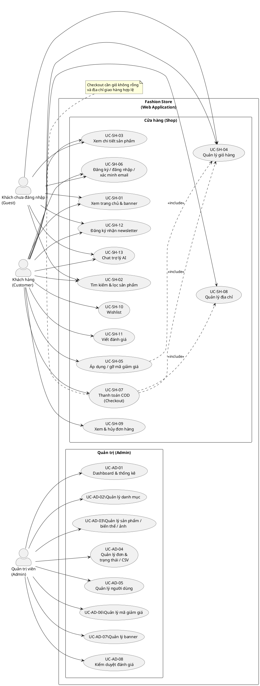
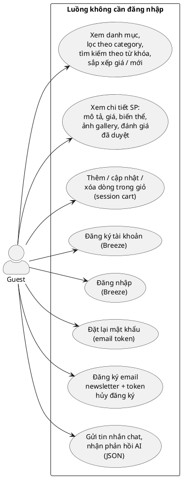
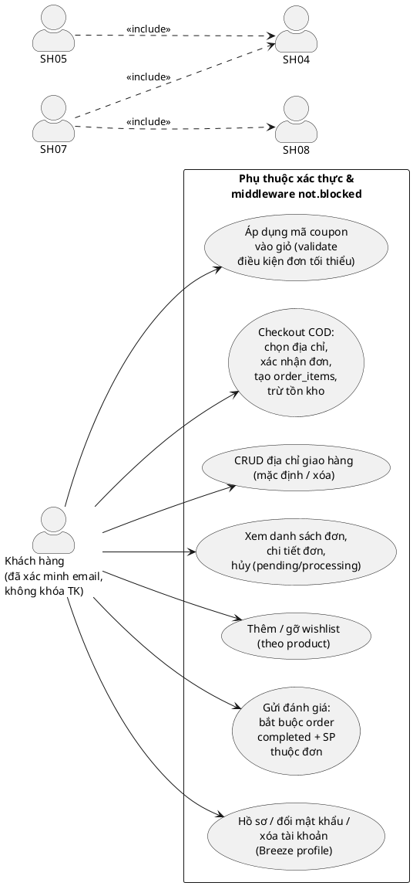
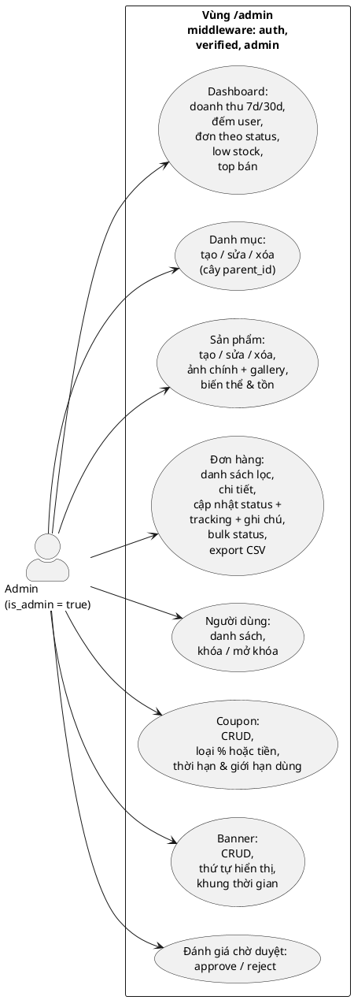
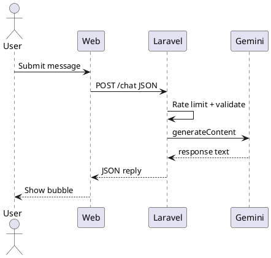

# Tài liệu thiết kế hệ thống — Fashion Store (Web TMĐT thời trang)

**Stack:** Laravel, MySQL, Vite + Tailwind + Alpine.js, Google Gemini API (chat)

---

## Mục lục

1. [Sơ đồ Use Case — tổng quan](#1-sơ-đồ-use-case--tổng-quan)
2. [Sơ đồ Use Case — Khách chưa đăng nhập](#2-sơ-đồ-use-case--khách-vãng-lai-guest)
3. [Sơ đồ Use Case — Khách hàng](#3-sơ-đồ-use-case--khách-hàng-customer)
4. [Sơ đồ Use Case — Quản trị](#4-sơ-đồ-use-case--quản-trị-admin)
5. [Đặc tả Use Case (đầy đủ)](#5-đặc-tả-use-case-đầy-đủ)
6. [Thiết kế & danh sách bảng CSDL (chi tiết từng bảng)](#6-thiết-kế--danh-sách-bảng-csdl-chi-tiết-từng-bảng)
7. [Mô hình Client–Server & luồng AI](#7-mô-hình-clientserver--luồng-ai)

---

## 1. Sơ đồ Use Case — tổng quan

Mối quan hệ **bao gồm (include)** / **mở rộng (extend)** và ranh giới hệ thống.



---

## 2. Sơ đồ Use Case — Khách chưa đăng nhập (Guest)



---

## 3. Sơ đồ Use Case — Khách hàng (Customer)



---

## 4. Sơ đồ Use Case — Quản trị (Admin)



---

## 5. Đặc tả Use Case (đầy đủ)

**Quy ước:** Mỗi UC có **mã**, **tác nhân**, **mục tiêu**, **tiền/hậu điều kiện**, **luồng chính**, **luồng thay thế / ngoại lệ**, **nghiệp vụ**.

---

### UC-SH-02 — Tìm kiếm & lọc sản phẩm

| Thuộc tính                   | Mô tả                                                                       |
| ---------------------------- | --------------------------------------------------------------------------- |
| **Mã UC**                    | UC-SH-02                                                                    |
| **Tên**                      | Tìm kiếm và lọc danh sách sản phẩm                                          |
| **Tác nhân chính**           | Guest, Customer                                                             |
| **Tác nhân phụ**             | —                                                                           |
| **Mục tiêu**                 | Người dùng tìm được sản phẩm theo từ khóa, danh mục, khoảng giá và sắp xếp. |
| **Tiền điều kiện**           | Hệ thống đang hoạt động; có dữ liệu sản phẩm `is_active = true`.            |
| **Hậu điều kiện thành công** | Hiển thị danh sách phân trang (12/trang) khớp tiêu chí.                     |
| **Hậu điều kiện thất bại**   | Hiển thị danh sách rỗng hoặc thông báo không có kết quả.                    |

**Luồng chính**

1. Người dùng mở `/products`.
2. (Tuỳ chọn) Nhập `q` (tìm trong `name`, `description`).
3. (Tuỳ chọn) Chọn `category` (filter `category_id`).
4. (Tuỳ chọn) Nhập `min`, `max` (filter giá).
5. (Tuỳ chọn) Chọn `sort`: newest / price_asc / price_desc / name.
6. Hệ thống truy vấn DB và render view.

**Luồng thay thế**

- 3a. Chỉ xem danh sách không filter → bước 6.

**Luồng ngoại lệ**

- Không có lỗi server → hiển thị trang lỗi HTTP 500.

**Quy tắc nghiệp vụ**

- Chỉ sản phẩm `is_active = true`.
- Query string được giữ khi phân trang (`withQueryString()`).

---

### UC-SH-03 — Xem chi tiết sản phẩm

| Thuộc tính                   | Mô tả                                                                            |
| ---------------------------- | -------------------------------------------------------------------------------- |
| **Mã UC**                    | UC-SH-03                                                                         |
| **Tên**                      | Xem chi tiết một sản phẩm                                                        |
| **Tác nhân**                 | Guest, Customer                                                                  |
| **Mục tiêu**                 | Xem thông tin đầy đủ để quyết định mua (giá, biến thể, ảnh, đánh giá công khai). |
| **Tiền điều kiện**           | Tồn tại `slug` hợp lệ và `is_active = true`.                                     |
| **Hậu điều kiện thành công** | Trang chi tiết được hiển thị.                                                    |
| **Hậu điều kiện thất bại**   | HTTP 404 nếu slug không tồn tại hoặc SP ngừng bán.                               |

**Luồng chính**

1. Người dùng chọn sản phẩm từ danh sách hoặc URL trực tiếp `/products/{slug}`.
2. Hệ thống tải `product` kèm `images`, `variants`, `category`.
3. Hệ thống tải `reviews` đã `is_approved = true`, kèm `user`, giới hạn 20 mới nhất.
4. Hiển thị form thêm giỏ (chọn biến thể, số lượng); nếu đăng nhập hiển thị wishlist & form đánh giá.

**Luồng ngoại lệ**

- Slug không khớp → `404`.

---

### UC-SH-04 — Quản lý giỏ hàng

| Thuộc tính                   | Mô tả                                                                                |
| ---------------------------- | ------------------------------------------------------------------------------------ |
| **Mã UC**                    | UC-SH-04                                                                             |
| **Tên**                      | Thêm / cập nhật / xóa sản phẩm trong giỏ                                             |
| **Tác nhân**                 | Guest (session), Customer (cart gắn user hoặc merge sau login)                       |
| **Mục tiêu**                 | Chuẩn bị đơn hàng với đúng biến thể và số lượng.                                     |
| **Tiền điều kiện**           | Biến thể thuộc sản phẩm đang active; tồn kho ≥ số lượng yêu cầu (khi thêm/cập nhật). |
| **Hậu điều kiện thành công** | Bản ghi `cart_items` phản ánh đúng `quantity`.                                       |

**Luồng chính — Thêm vào giỏ**

1. Từ trang chi tiết, người dùng chọn `product_variant_id`, `quantity`.
2. Hệ thống xác thực `exists:product_variants`.
3. Kiểm tra `stock`; nếu đủ → upsert dòng `cart_items` (unique theo cart + variant).

**Luồng chính — Cập nhật / xóa**

1. Tại `/cart`, chỉnh `quantity` hoặc xóa dòng.
2. Cập nhật hoặc xóa `cart_items`.

**Luồng ngoại lệ**

- Hết hàng → thông báo lỗi, không thêm.
- Sản phẩm inactive → không cho thêm.

---

### UC-SH-05 — Áp dụng mã giảm giá

| Thuộc tính         | Mô tả                                                                            |
| ------------------ | -------------------------------------------------------------------------------- |
| **Mã UC**          | UC-SH-05                                                                         |
| **Tên**            | Áp dụng hoặc gỡ mã coupon trên giỏ                                               |
| **Tác nhân**       | Customer (đã đăng nhập)                                                          |
| **Mục tiêu**       | Giảm giá đơn hàng khi đủ điều kiện.                                              |
| **Tiền điều kiện** | Đã đăng nhập; có giỏ hàng.                                                       |
| **Hậu điều kiện**  | `applied_coupon_code` trên `carts` được set hoặc clear; tổng tiền hiển thị đúng. |

**Luồng chính — Áp dụng**

1. Người dùng nhập mã, submit form coupon.
2. Hệ thống kiểm tra mã tồn tại, `is_active`, khung thời gian, `min_order_amount`, tồn dùng (nếu có `max_uses`).
3. Lưu mã vào giỏ (session).

**Luồng chính — Gỡ**

1. Người dùng bấm gỡ coupon.
2. Xóa `applied_coupon_code` khỏi giỏ.

**Luồng ngoại lệ**

- Mã không hợp lệ → thông báo, không áp dụng.

---

### UC-SH-06 — Đăng ký / đăng nhập / xác minh email

| Thuộc tính         | Mô tả                                                                                       |
| ------------------ | ------------------------------------------------------------------------------------------- |
| **Mã UC**          | UC-SH-06                                                                                    |
| **Tên**            | Xác thực người dùng (Breeze)                                                                |
| **Tác nhân**       | Guest → Customer                                                                            |
| **Mục tiêu**       | Có tài khoản và phiên đăng nhập an toàn; email verified để dùng checkout và khu vực bảo vệ. |
| **Tiền điều kiện** | —                                                                                           |
| **Hậu điều kiện**  | User trong bảng `users`; `email_verified_at` set sau khi verify.                            |

**Luồng chính (rút gọn theo Breeze)**

1. Đăng ký: nhập name, email, password → gửi email verification.
2. Đăng nhập: session + remember token tùy chọn.
3. Xác minh: click link signed → `email_verified_at` cập nhật.

**Luồng ngoại lệ**

- Email trùng → lỗi validation.
- Sai mật khẩu → từ chối đăng nhập.

---

### UC-SH-07 — Thanh toán COD (Checkout)

| Thuộc tính                   | Mô tả                                                                                                                                |
| ---------------------------- | ------------------------------------------------------------------------------------------------------------------------------------ |
| **Mã UC**                    | UC-SH-07                                                                                                                             |
| **Tên**                      | Đặt hàng thanh toán khi nhận hàng                                                                                                    |
| **Tác nhân**                 | Customer                                                                                                                             |
| **Mục tiêu**                 | Tạo đơn hàng, snapshot địa chỉ & giá, trừ kho.                                                                                       |
| **Tiền điều kiện**           | `auth` + `verified` + `not.blocked`; giỏ không rỗng; đủ tồn cho từng dòng; có địa chỉ (id hoặc nhập tay).                            |
| **Hậu điều kiện thành công** | Bản ghi `orders` + `order_items`; `order_number` duy nhất; variant giảm `stock`; giỏ xóa dòng; coupon tăng `used_count` nếu có giảm. |
| **Hậu điều kiện thất bại**   | Không tạo đơn; hiển thị lỗi.                                                                                                         |

**Luồng chính**

1. GET `/checkout` — hiển thị giỏ, tổng tiền, địa chỉ.
2. POST `/checkout` — chọn `address_id` hoặc địa chỉ nhập tay; `customer_note` tuỳ chọn.
3. `OrderService::placeFromCart` trong transaction:
    - Tính subtotal, ship, discount, total.
    - Tạo `orders` status `pending`, payment `cod`.
    - Với mỗi cart line: tạo `order_items`, `decrement` stock.
    - Xóa `cart_items`, clear coupon trên giỏ.
    - (Event) gửi mail tuỳ cấu hình.

**Luồng thay thế**

- 2a. Giỏ rỗng → redirect về `/cart` với flash error.

**Luồng ngoại lệ**

- Không đủ stock → exception, rollback transaction.

---

### UC-SH-08 — Quản lý địa chỉ giao hàng

| Thuộc tính         | Mô tả                                                                           |
| ------------------ | ------------------------------------------------------------------------------- |
| **Mã UC**          | UC-SH-08                                                                        |
| **Tên**            | Thêm, sửa, xóa địa chỉ; đặt mặc định                                            |
| **Tác nhân**       | Customer                                                                        |
| **Mục tiêu**       | Lưu địa chỉ để dùng tại checkout.                                               |
| **Tiền điều kiện** | Đã đăng nhập & verified & không khóa.                                           |
| **Hậu điều kiện**  | Bản ghi trong `addresses` đúng `user_id`; chỉ một `is_default = true` nếu chọn. |

**Luồng chính**

1. GET `/addresses` — liệt kê địa chỉ.
2. POST tạo mới — validate các trường bắt buộc; nếu default → clear default các địa chỉ khác.
3. PATCH cập nhật — chỉ sửa địa chỉ của chính user (policy implicit).
4. DELETE — xóa địa chỉ đã chọn.

**Luồng ngoại lệ**

- Truy cập địa chỉ user khác → 403.

---

### UC-SH-09 — Xem & hủy đơn hàng

| Thuộc tính              | Mô tả                                                              |
| ----------------------- | ------------------------------------------------------------------ |
| **Mã UC**               | UC-SH-09                                                           |
| **Tên**                 | Theo dõi đơn và hủy khi được phép                                  |
| **Tác nhân**            | Customer                                                           |
| **Mục tiêu**            | Xem lịch sử; hủy đơn ở trạng thái cho phép.                        |
| **Tiền điều kiện**      | Đơn thuộc `user_id` hiện tại.                                      |
| **Hậu điều kiện (hủy)** | Status `cancelled`; hoàn tồn kho; hoàn `used_count` coupon nếu có. |

**Luồng chính — Xem**

1. GET `/orders` — phân trang.
2. GET `/orders/{order}` — chi tiết + items.

**Luồng chính — Hủy**

1. POST cancel chỉ khi status ∈ {pending, processing}.
2. `OrderService::cancelByUser` restock + cập nhật trạng thái.

**Luồng ngoại lệ**

- Đơn của người khác → 403.
- Trạng thái không cho hủy → exception message.

---

### UC-SH-10 — Wishlist

| Thuộc tính         | Mô tả                                                         |
| ------------------ | ------------------------------------------------------------- |
| **Mã UC**          | UC-SH-10                                                      |
| **Tên**            | Thêm / gỡ sản phẩm yêu thích                                  |
| **Tác nhân**       | Customer                                                      |
| **Mục tiêu**       | Lưu `product_id` để xem lại sau.                              |
| **Tiền điều kiện** | Đăng nhập.                                                    |
| **Hậu điều kiện**  | Bản ghi `wishlist_items` hoặc đã xóa; unique (user, product). |

**Luồng chính**

1. POST toggle trên trang sản phẩm.
2. Nếu đã có → xóa; chưa có → tạo.

---

### UC-SH-11 — Viết đánh giá sản phẩm

| Thuộc tính         | Mô tả                                                                                 |
| ------------------ | ------------------------------------------------------------------------------------- |
| **Mã UC**          | UC-SH-11                                                                              |
| **Tên**            | Gửi đánh giá sau khi mua                                                              |
| **Tác nhân**       | Customer                                                                              |
| **Mục tiêu**       | Tạo `reviews` chờ duyệt hoặc hiển thị sau approve.                                    |
| **Tiền điều kiện** | Order `completed`; đơn chứa `product_id`; một user chỉ một review / product (unique). |
| **Hậu điều kiện**  | Review lưu DB; gửi mail báo admin tuỳ cấu hình.                                       |

**Luồng chính**

1. Nhập `order_id`, `rating`, `comment`.
2. Validate ownership và điều kiện order.
3. Lưu `is_approved = false` (hoặc quy tắc hiện tại của hệ thống).

**Luồng ngoại lệ**

- Order chưa completed → lỗi.

---

### UC-SH-12 — Newsletter

| Thuộc tính        | Mô tả                                     |
| ----------------- | ----------------------------------------- |
| **Mã UC**         | UC-SH-12                                  |
| **Tên**           | Đăng ký / hủy nhận tin                    |
| **Tác nhân**      | Guest / Customer                          |
| **Mục tiêu**      | Lưu email vào `newsletter_subscriptions`. |
| **Hậu điều kiện** | Email unique; token hủy duy nhất.         |

---

### UC-SH-13 — Chat trợ lý AI

| Thuộc tính         | Mô tả                                                |
| ------------------ | ---------------------------------------------------- |
| **Mã UC**          | UC-SH-13                                             |
| **Tên**            | Chat với Gemini qua backend                          |
| **Tác nhân**       | Guest / Customer                                     |
| **Mục tiêu**       | Trả lời câu hỏi mua sắm ngắn gọn.                    |
| **Tiền điều kiện** | `GEMINI_API_KEY` (hoặc nhận message cấu hình thiếu). |
| **Hậu điều kiện**  | JSON `{ reply }`; rate limit theo user/IP.           |

**Luồng chính**

1. POST `/chat` với `{ message }`.
2. `GeminiService` gọi Google Generative Language API.
3. Trả text cho widget.

---

### UC-AD-02 — CRUD danh mục

| Thuộc tính         | Mô tả                                                                     |
| ------------------ | ------------------------------------------------------------------------- |
| **Mã UC**          | UC-AD-02                                                                  |
| **Tên**            | Quản lý danh mục đa cấp                                                   |
| **Tác nhân**       | Admin                                                                     |
| **Tiền điều kiện** | `auth`, `verified`, `admin`.                                              |
| **Luồng chính**    | CRUD trên `categories`; `parent_id` tham chiếu `categories`; slug unique. |

---

### UC-AD-03 — CRUD sản phẩm

| Thuộc tính      | Mô tả                                                                                                                                   |
| --------------- | --------------------------------------------------------------------------------------------------------------------------------------- |
| **Mã UC**       | UC-AD-03                                                                                                                                |
| **Tên**         | Quản lý sản phẩm, biến thể, ảnh                                                                                                         |
| **Tác nhân**    | Admin                                                                                                                                   |
| **Luồng chính** | Tạo/sửa `products`; upload ảnh lưu disk `public`; quản lý `product_variants` (unique size+color per product); gallery `product_images`. |

---

### UC-AD-04 — Quản lý đơn hàng

| Thuộc tính      | Mô tả                                                                          |
| --------------- | ------------------------------------------------------------------------------ |
| **Mã UC**       | UC-AD-04                                                                       |
| **Tên**         | Xem, lọc, cập nhật trạng thái, bulk, export                                    |
| **Tác nhân**    | Admin                                                                          |
| **Luồng chính** | Danh sách có filter; chi tiết; PATCH status + tracking; bulk POST; export CSV. |

---

### UC-AD-05 — Quản lý người dùng

| Thuộc tính      | Mô tả                                                                             |
| --------------- | --------------------------------------------------------------------------------- |
| **Mã UC**       | UC-AD-05                                                                          |
| **Tên**         | Xem user, khóa/mở khóa                                                            |
| **Tác nhân**    | Admin                                                                             |
| **Luồng chính** | Toggle `is_blocked`; user bị khóa bị logout và chặn bởi middleware `not.blocked`. |

---

### UC-AD-06 — CRUD Coupon

| Thuộc tính      | Mô tả                                                          |
| --------------- | -------------------------------------------------------------- |
| **Mã UC**       | UC-AD-06                                                       |
| **Tên**         | Tạo mã giảm giá                                                |
| **Tác nhân**    | Admin                                                          |
| **Luồng chính** | CRUD `coupons`; type/value/min/max_uses/starts/ends/is_active. |

---

### UC-AD-07 — CRUD Banner

| Thuộc tính      | Mô tả                                                                                      |
| --------------- | ------------------------------------------------------------------------------------------ |
| **Mã UC**       | UC-AD-07                                                                                   |
| **Tên**         | Quản lý banner trang chủ                                                                   |
| **Tác nhân**    | Admin                                                                                      |
| **Luồng chính** | Upload ảnh hoặc URL (validation đã hỗ trợ path/URL); `sort_order`, `starts_at`, `ends_at`. |

---

### UC-AD-08 — Kiểm duyệt đánh giá

| Thuộc tính        | Mô tả                                                                    |
| ----------------- | ------------------------------------------------------------------------ |
| **Mã UC**         | UC-AD-08                                                                 |
| **Tên**           | Approve / reject review                                                  |
| **Tác nhân**      | Admin                                                                    |
| **Hậu điều kiện** | Review approve → cập nhật `review_count`, `average_rating` trên product. |

---

## 6. Thiết kế & danh sách bảng CSDL (chi tiết từng bảng)

**Quy ước cột:** Kiểu ghi theo migration Laravel (chuỗi độ dài = VARCHAR). **PK** = khóa chính, **FK** = khóa ngoại, **UK** = unique.

---

### Bảng `users`

**Chức năng:** Tài khoản đăng nhập; phân quyền admin; khóa tài khoản; số điện thoại phục vụ địa chỉ/checkout.

| Cột                    | Kiểu            | NULL | Khóa / Ràng buộc | Mô tả              |
| ---------------------- | --------------- | ---- | ---------------- | ------------------ |
| id                     | BIGINT UNSIGNED | NO   | PK, AI           | Định danh          |
| name                   | VARCHAR         | NO   |                  | Họ tên hiển thị    |
| email                  | VARCHAR         | NO   | UK               | Email đăng nhập    |
| email_verified_at      | TIMESTAMP       | YES  |                  | Thời điểm xác minh |
| password               | VARCHAR         | NO   |                  | Hash mật khẩu      |
| remember_token         | VARCHAR         | YES  |                  | Remember me        |
| is_admin               | BOOLEAN         | NO   | DEFAULT false    | Quyền vào `/admin` |
| phone                  | VARCHAR(32)     | YES  |                  | SĐT liên hệ        |
| is_blocked             | BOOLEAN         | NO   | DEFAULT false    | Khóa đăng nhập     |
| created_at, updated_at | TIMESTAMP       | YES  |                  | Laravel timestamps |

**Quan hệ:** 1–n với `addresses`, `orders`, `reviews`, `wishlist_items`; 1–1 với `carts` (theo user).

---

### Bảng `password_reset_tokens`

**Chức năng:** Token đặt lại mật khẩu (Laravel Breeze).

| Cột        | Kiểu      | NULL | Khóa | Mô tả               |
| ---------- | --------- | ---- | ---- | ------------------- |
| email      | VARCHAR   | NO   | PK   | Email người yêu cầu |
| token      | VARCHAR   | NO   |      | Token hash          |
| created_at | TIMESTAMP | YES  |      | Thời điểm tạo       |

---

### Bảng `sessions`

**Chức năng:** Lưu phiên khi `SESSION_DRIVER=database`.

| Cột           | Kiểu            | NULL | Khóa                     | Mô tả                |
| ------------- | --------------- | ---- | ------------------------ | -------------------- |
| id            | VARCHAR         | NO   | PK                       | Session id           |
| user_id       | BIGINT UNSIGNED | YES  | FK→users, INDEX NULLABLE | User đăng nhập       |
| ip_address    | VARCHAR(45)     | YES  |                          | IPv4/IPv6            |
| user_agent    | TEXT            | YES  |                          | UA browser           |
| payload       | LONGTEXT        | NO   |                          | Dữ liệu phiên mã hoá |
| last_activity | INTEGER         | NO   | INDEX                    | Unix activity        |

---

### Bảng `categories`

**Chức năng:** Danh mục dạng cây (self-reference).

| Cột                    | Kiểu             | NULL | Khóa                                 | Mô tả        |
| ---------------------- | ---------------- | ---- | ------------------------------------ | ------------ |
| id                     | BIGINT UNSIGNED  | NO   | PK                                   |              |
| name                   | VARCHAR          | NO   |                                      | Tên hiển thị |
| slug                   | VARCHAR          | NO   | UK                                   | URL-friendly |
| parent_id              | BIGINT UNSIGNED  | YES  | FK→categories.id, ON DELETE SET NULL | Danh mục cha |
| position               | UNSIGNED INTEGER | NO   | DEFAULT 0                            | Thứ tự sort  |
| is_active              | BOOLEAN          | NO   | DEFAULT true                         | Ẩn/hiện      |
| created_at, updated_at | TIMESTAMP        | YES  |                                      |              |

---

### Bảng `products`

**Chức năng:** Sản phẩm bán; gắn một danh mục; thống kê đánh giá denormalized.

| Cột                    | Kiểu             | NULL | Khóa                            | Mô tả                                |
| ---------------------- | ---------------- | ---- | ------------------------------- | ------------------------------------ |
| id                     | BIGINT UNSIGNED  | NO   | PK                              |                                      |
| category_id            | BIGINT UNSIGNED  | NO   | FK→categories.id CASCADE DELETE |                                      |
| name                   | VARCHAR          | NO   |                                 | Tên SP                               |
| slug                   | VARCHAR          | NO   | UK                              | URL                                  |
| description            | TEXT             | YES  |                                 | Mô tả HTML/text                      |
| main_image             | VARCHAR(500)     | YES  |                                 | Đường dẫn storage hoặc URL ảnh chính |
| price                  | DECIMAL(12,2)    | NO   |                                 | Giá bán hiển thị                     |
| compare_price          | DECIMAL(12,2)    | YES  |                                 | Giá gốc (flash sale)                 |
| sku                    | VARCHAR(64)      | YES  |                                 | Mã SKU tổng                          |
| is_featured            | BOOLEAN          | NO   | DEFAULT false                   | SP nổi bật trang chủ                 |
| is_active              | BOOLEAN          | NO   | DEFAULT true                    | Ngừng kinh doanh                     |
| review_count           | UNSIGNED INTEGER | NO   | DEFAULT 0                       | Số review đã duyệt                   |
| average_rating         | DECIMAL(3,2)     | NO   | DEFAULT 0                       | Điểm trung bình                      |
| created_at, updated_at | TIMESTAMP        | YES  |                                 |                                      |

---

### Bảng `product_images`

**Chức năng:** Ảnh phụ / gallery.

| Cột                    | Kiểu             | NULL | Khóa                   | Mô tả              |
| ---------------------- | ---------------- | ---- | ---------------------- | ------------------ |
| id                     | BIGINT UNSIGNED  | NO   | PK                     |                    |
| product_id             | BIGINT UNSIGNED  | NO   | FK→products.id CASCADE |                    |
| path                   | VARCHAR          | NO   |                        | File disk hoặc URL |
| position               | UNSIGNED INTEGER | NO   | DEFAULT 0              | Thứ tự             |
| created_at, updated_at | TIMESTAMP        | YES  |                        |                    |

---

### Bảng `product_variants`

**Chức năng:** Biến thể size/màu, tồn kho; giá riêng optional.

| Cột                    | Kiểu             | NULL | Khóa                        | Mô tả                   |
| ---------------------- | ---------------- | ---- | --------------------------- | ----------------------- |
| id                     | BIGINT UNSIGNED  | NO   | PK                          |                         |
| product_id             | BIGINT UNSIGNED  | NO   | FK→products.id CASCADE      |                         |
| size                   | VARCHAR(32)      | NO   |                             | UK cùng product+color   |
| color                  | VARCHAR(64)      | NO   |                             |                         |
| sku                    | VARCHAR(64)      | YES  |                             | SKU biến thể            |
| price                  | DECIMAL(12,2)    | YES  |                             | Null → dùng giá product |
| stock                  | UNSIGNED INTEGER | NO   | DEFAULT 0                   | Tồn                     |
| created_at, updated_at | TIMESTAMP        | YES  |                             |                         |
| —                      | —                | —    | UK(product_id, size, color) |                         |

---

### Bảng `coupons`

**Chức năng:** Mã khuyến mãi (enum type trong app: % hoặc tiền).

| Cột                    | Kiểu             | NULL | Khóa         | Mô tả                                 |
| ---------------------- | ---------------- | ---- | ------------ | ------------------------------------- |
| id                     | BIGINT UNSIGNED  | NO   | PK           |                                       |
| code                   | VARCHAR(32)      | NO   | UK           | Mã nhập                               |
| type                   | VARCHAR(16)      | NO   |              | Loại giảm                             |
| value                  | DECIMAL(12,2)    | NO   |              | Giá trị % hoặc tiền                   |
| min_order_amount       | DECIMAL(12,2)    | NO   | DEFAULT 0    | Đơn tối thiểu                         |
| max_uses               | UNSIGNED INTEGER | YES  |              | Giới hạn lượt (null = không giới hạn) |
| used_count             | UNSIGNED INTEGER | NO   | DEFAULT 0    | Đã dùng                               |
| starts_at              | TIMESTAMP        | YES  |              | Bắt đầu hiệu lực                      |
| ends_at                | TIMESTAMP        | YES  |              | Kết thúc                              |
| is_active              | BOOLEAN          | NO   | DEFAULT true |                                       |
| created_at, updated_at | TIMESTAMP        | YES  |              |                                       |

---

### Bảng `addresses`

**Chức năng:** Địa chỉ giao hàng của user.

| Cột                    | Kiểu            | NULL | Khóa                | Mô tả            |
| ---------------------- | --------------- | ---- | ------------------- | ---------------- |
| id                     | BIGINT UNSIGNED | NO   | PK                  |                  |
| user_id                | BIGINT UNSIGNED | NO   | FK→users.id CASCADE |                  |
| full_name              | VARCHAR         | NO   |                     | Người nhận       |
| phone                  | VARCHAR(32)     | NO   |                     |                  |
| line1                  | VARCHAR         | NO   |                     | Địa chỉ dòng 1   |
| line2                  | VARCHAR         | YES  |                     | Dòng 2           |
| city                   | VARCHAR(128)    | NO   |                     |                  |
| state                  | VARCHAR(128)    | YES  |                     | Bang/tỉnh        |
| postal_code            | VARCHAR(32)     | NO   |                     | Mã bưu điện      |
| country                | VARCHAR(2)      | NO   | DEFAULT VN          | ISO country      |
| is_default             | BOOLEAN         | NO   | DEFAULT false       | Địa chỉ mặc định |
| created_at, updated_at | TIMESTAMP       | YES  |                     |                  |

---

### Bảng `carts`

**Chức năng:** Giỏ — một giỏ / user (unique user_id); khách dùng session_id.

| Cột                    | Kiểu            | NULL | Khóa                             | Mô tả                |
| ---------------------- | --------------- | ---- | -------------------------------- | -------------------- |
| id                     | BIGINT UNSIGNED | NO   | PK                               |                      |
| user_id                | BIGINT UNSIGNED | YES  | FK→users.id CASCADE, UK(user_id) | Null nếu chỉ session |
| session_id             | VARCHAR(128)    | YES  | INDEX                            | Khách chưa login     |
| applied_coupon_code    | VARCHAR(32)     | YES  |                                  | Mã đang áp           |
| created_at, updated_at | TIMESTAMP       | YES  |                                  |                      |

---

### Bảng `cart_items`

**Chức năng:** Dòng hàng trong giỏ.

| Cột                    | Kiểu             | NULL | Khóa                            | Mô tả |
| ---------------------- | ---------------- | ---- | ------------------------------- | ----- |
| id                     | BIGINT UNSIGNED  | NO   | PK                              |       |
| cart_id                | BIGINT UNSIGNED  | NO   | FK→carts.id CASCADE             |       |
| product_variant_id     | BIGINT UNSIGNED  | NO   | FK→product_variants.id CASCADE  |       |
| quantity               | UNSIGNED INTEGER | NO   | DEFAULT 1                       |       |
| created_at, updated_at | TIMESTAMP        | YES  |                                 |       |
| —                      | —                | —    | UK(cart_id, product_variant_id) |       |

---

### Bảng `wishlist_items`

**Chức năng:** Yêu thích theo user + product.

| Cột                    | Kiểu            | NULL | Khóa                    | Mô tả |
| ---------------------- | --------------- | ---- | ----------------------- | ----- |
| id                     | BIGINT UNSIGNED | NO   | PK                      |       |
| user_id                | BIGINT UNSIGNED | NO   | FK→users.id CASCADE     |       |
| product_id             | BIGINT UNSIGNED | NO   | FK→products.id CASCADE  |       |
| created_at, updated_at | TIMESTAMP       | YES  |                         |       |
| —                      | —               | —    | UK(user_id, product_id) |       |

---

### Bảng `orders`

**Chức năng:** Đơn hàng; snapshot địa chỉ & thanh toán tại thời điểm đặt.

| Cột                    | Kiểu            | NULL | Khóa                   | Mô tả                |
| ---------------------- | --------------- | ---- | ---------------------- | -------------------- |
| id                     | BIGINT UNSIGNED | NO   | PK                     |                      |
| order_number           | VARCHAR(32)     | NO   | UK                     | Mã đơn hiển thị      |
| user_id                | BIGINT UNSIGNED | NO   | FK→users.id CASCADE    |                      |
| status                 | VARCHAR(32)     | NO   | INDEX                  | pending/processing/… |
| payment_method         | VARCHAR(32)     | NO   | DEFAULT cod            |                      |
| subtotal               | DECIMAL(12,2)   | NO   |                        |                      |
| discount_total         | DECIMAL(12,2)   | NO   | DEFAULT 0              |                      |
| shipping               | DECIMAL(12,2)   | NO   | DEFAULT 0              |                      |
| total                  | DECIMAL(12,2)   | NO   |                        |                      |
| coupon_id              | BIGINT UNSIGNED | YES  | FK→coupons.id SET NULL |                      |
| coupon_code            | VARCHAR(32)     | YES  |                        | Snapshot mã          |
| recipient_name         | VARCHAR         | NO   |                        | Snapshot             |
| phone                  | VARCHAR(32)     | NO   |                        |                      |
| line1                  | VARCHAR         | NO   |                        |                      |
| line2                  | VARCHAR         | YES  |                        |                      |
| city                   | VARCHAR(128)    | NO   |                        |                      |
| state                  | VARCHAR(128)    | YES  |                        |                      |
| postal_code            | VARCHAR(32)     | NO   |                        |                      |
| country                | VARCHAR(2)      | NO   | DEFAULT VN             |                      |
| customer_note          | TEXT            | YES  |                        |                      |
| admin_note             | TEXT            | YES  |                        | Ghi chú nội bộ       |
| tracking_number        | VARCHAR(64)     | YES  |                        |                      |
| created_at, updated_at | TIMESTAMP       | YES  |                        |                      |

---

### Bảng `order_items`

**Chức năng:** Chi tiết đơn — snapshot tên/giá biến thể.

| Cột                    | Kiểu             | NULL | Khóa                         | Mô tả                         |
| ---------------------- | ---------------- | ---- | ---------------------------- | ----------------------------- |
| id                     | BIGINT UNSIGNED  | NO   | PK                           |                               |
| order_id               | BIGINT UNSIGNED  | NO   | FK→orders.id CASCADE         |                               |
| product_id             | BIGINT UNSIGNED  | NO   | FK→products.id RESTRICT      | Không xóa SP nếu còn dòng đơn |
| product_variant_id     | BIGINT UNSIGNED  | YES  | FK→product_variants SET NULL |                               |
| name                   | VARCHAR          | NO   |                              | Tên SP lúc đặt                |
| sku                    | VARCHAR(64)      | YES  |                              |                               |
| size                   | VARCHAR(32)      | YES  |                              |                               |
| color                  | VARCHAR(64)      | YES  |                              |                               |
| unit_price             | DECIMAL(12,2)    | NO   |                              |                               |
| quantity               | UNSIGNED INTEGER | NO   |                              |                               |
| line_total             | DECIMAL(12,2)    | NO   |                              |                               |
| created_at, updated_at | TIMESTAMP        | YES  |                              |                               |

---

### Bảng `reviews`

**Chức năng:** Đánh giá sản phẩm; duyệt trước khi public.

| Cột                    | Kiểu             | NULL | Khóa                    | Mô tả              |
| ---------------------- | ---------------- | ---- | ----------------------- | ------------------ |
| id                     | BIGINT UNSIGNED  | NO   | PK                      |                    |
| user_id                | BIGINT UNSIGNED  | NO   | FK→users.id CASCADE     |                    |
| product_id             | BIGINT UNSIGNED  | NO   | FK→products.id CASCADE  |                    |
| order_id               | BIGINT UNSIGNED  | YES  | FK→orders.id SET NULL   | Minh chứng mua     |
| rating                 | TINYINT UNSIGNED | NO   |                         | 1–5                |
| comment                | TEXT             | YES  |                         |                    |
| is_approved            | BOOLEAN          | NO   | DEFAULT false           |                    |
| created_at, updated_at | TIMESTAMP        | YES  |                         |                    |
| —                      | —                | —    | UK(user_id, product_id) | Một review/user/SP |

---

### Bảng `newsletter_subscriptions`

**Chức năng:** Email marketing & hủy đăng ký an toàn.

| Cột                    | Kiểu            | NULL | Khóa         | Mô tả                |
| ---------------------- | --------------- | ---- | ------------ | -------------------- |
| id                     | BIGINT UNSIGNED | NO   | PK           |                      |
| email                  | VARCHAR         | NO   | UK           |                      |
| unsubscribe_token      | VARCHAR(64)     | NO   | UK           | Token trong link hủy |
| is_active              | BOOLEAN         | NO   | DEFAULT true |                      |
| created_at, updated_at | TIMESTAMP       | YES  |              |                      |

---

### Bảng `banners`

**Chức năng:** Slider / banner trang chủ.

| Cột                    | Kiểu             | NULL | Khóa         | Mô tả                 |
| ---------------------- | ---------------- | ---- | ------------ | --------------------- |
| id                     | BIGINT UNSIGNED  | NO   | PK           |                       |
| title                  | VARCHAR          | NO   |              | Tiêu đề + overlay     |
| image_path             | VARCHAR          | NO   |              | Storage path hoặc URL |
| link_url               | VARCHAR(500)     | YES  |              | Đích đến              |
| sort_order             | UNSIGNED INTEGER | NO   | DEFAULT 0    |                       |
| starts_at              | TIMESTAMP        | YES  |              | Hiển thị từ           |
| ends_at                | TIMESTAMP        | YES  |              | Đến                   |
| is_active              | BOOLEAN          | NO   | DEFAULT true |                       |
| created_at, updated_at | TIMESTAMP        | YES  |              |                       |

---

### Bảng `settings`

**Chức năng:** Key–value cấu hình (email hỗ trợ, v.v.).

| Cột                    | Kiểu            | NULL | Khóa | Mô tả |
| ---------------------- | --------------- | ---- | ---- | ----- |
| id                     | BIGINT UNSIGNED | NO   | PK   |       |
| key                    | VARCHAR(64)     | NO   | UK   |       |
| value                  | TEXT            | YES  |      |       |
| created_at, updated_at | TIMESTAMP       | YES  |      |       |

---

### Bảng `cache` / `cache_locks`

**Chức năng:** Driver cache database (nếu bật).

| cache | key PK, value MEDIUMTEXT, expiration BIGINT INDEX |
| cache_locks | key PK, owner, expiration |

---

### Bảng `jobs` / `job_batches` / `failed_jobs`

**Chức năng:** Hàng đợi Laravel (mail queue, v.v.).

- **jobs:** id, queue, payload, attempts, reserved_at, available_at, created_at.
- **job_batches:** id (string PK), name, counters, failed_job_ids, options, cancelled_at, timestamps.
- **failed_jobs:** id, uuid UK, connection, queue, payload, exception, failed_at.

---

**Sơ đồ ER:** Nên **export từ MySQL** (Workbench / phpMyAdmin / DBeaver) và chèn vào báo cáo để khớp index và kiểu thực tế trên server.

---

## 7. Mô hình Client–Server & luồng AI

### Sơ đồ kiến trúc (PlantUML)

```plantuml
@startuml ClientServer
actor User
node Client [Browser\nBlade + Alpine + Vite assets]
node Server [Laravel\nPHP-FPM / Artisan]
database MySQL as DB
cloud Gemini [Google Gemini API]

User --> Client
Client --> Server : HTTPS
Server --> DB
Server --> Gemini : HTTPS REST
@enduml
```

### Sequence chat AI



---

_Tài liệu bám migration trong `database/migrations`. Khi schema thay đổi, cập nhật lại mục 6 và export ER mới._
